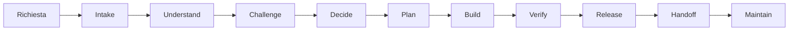
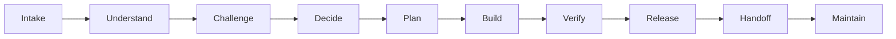
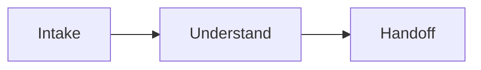
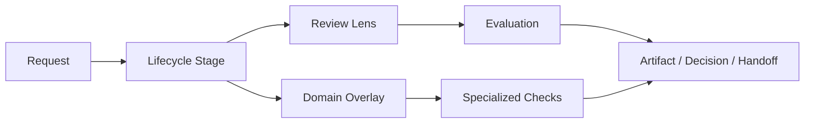
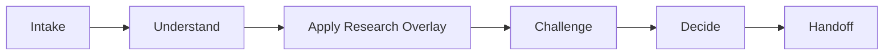
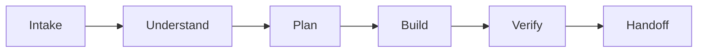
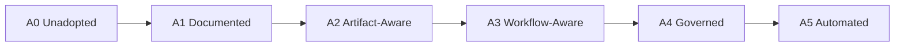
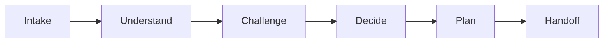
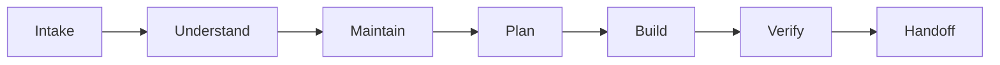
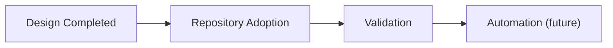

Languages: [ English](README.md) · [ Italiano](README.it.md)

# Skunklabs Codex OS

La maggior parte dei framework per agenti AI ottimizza l'esecuzione.

Agent OS ottimizza il giudizio.

Dà all'ingegneria assistita da AI un lifecycle, un modello di governance, modalità di review, gestione della conoscenza e workflow decisionali.

È progettato per funzionare con Codex, Claude Code, Gemini CLI, OpenHands, agenti in stile Cursor e piattaforme agenti future.

---

⚠️ Agent OS è attualmente in validazione attiva.

Il modello di architettura e governance è completo.
La fase successiva è l'adozione reale e il feedback.

Contributi, critiche ed esperimenti sono benvenuti.

---

COS, Codex Operating System, nasce da un problema molto pratico: quando si lavora con agenti AI su repository reali, far scrivere codice non è la parte difficile. La parte difficile è farli ragionare con ordine, rispettare il contesto del progetto, lasciare tracce utili e non prendere scorciatoie nei punti sbagliati.

Questo repository raccoglie il design di quel sistema operativo di lavoro.

Non è una libreria. Non è un runtime. Non è un generatore di cartelle. Per ora è una specifica: un modo condiviso per dire a un agente come affrontare ricerca, decisioni, implementazione, manutenzione, review, handoff e governance dentro una codebase.

## Indice

* Perché esiste
* Per chi è
* Che problemi risolve
* Come si è evoluta l'idea
* Le scoperte più importanti
* Il modello attuale, con diagramma del lifecycle
* Concetti chiave, con relazione tra stage, lens, overlay e artifact
* Cosa COS non è
* Perché non siamo partiti dall'automazione
* Come usarlo, con livelli di adozione
* Esempi di workflow
* Struttura della repository
* Stato della documentazione
* Stato attuale

## Perché esiste

Gli agenti AI sono bravi a muoversi velocemente. A volte troppo.

In una codebase vera, velocità senza disciplina diventa rumore: piani vaghi, file modificati prima di capire il problema, decisioni perse in chat, verifiche saltate, documenti che invecchiano senza che nessuno se ne accorga.

COS mette una piccola struttura attorno a quel lavoro. Non per appesantirlo. L'idea è semplice: ogni richiesta deve passare dal livello giusto di comprensione, decisione, verifica e memoria.

Una correzione di testo non deve diventare una riunione di architettura. Una migrazione dati, invece, non può essere trattata come una patch locale.

## Per chi è

COS è pensato per persone che lavorano su repository dove il contesto conta: software engineer, architect, platform engineer, DevOps engineer, maintainer e power user di agenti come Codex, Claude Code o strumenti simili.

Serve soprattutto quando gli agenti fanno più di qualche task isolato: ricerca tecnica, decisioni architetturali, implementazione, manutenzione, review o handoff tra sessioni diverse.

È utile anche a chi lavora da solo o in team piccoli e usa molto gli agenti AI. In quei casi spesso la stessa persona tiene insieme architettura, implementazione, documentazione e decisioni. COS aiuta a non perdere continuità tra una sessione e l'altra.

Probabilmente non ti serve se la repo è piccola, il lavoro è quasi sempre locale e reversibile, o se usi l'AI solo per risposte rapide e snippet usa-e-getta. In quei casi COS rischia di essere più struttura di quanta ne serva.

## Che problemi risolve

In pratica, COS serve quando iniziano a comparire questi problemi:

* richieste poco chiare trasformate troppo presto in codice
* decisioni architetturali lasciate solo nella conversazione
* ricerca tecnica senza fonti, freschezza o raccomandazione esplicita
* review confuse tra critica, challenge, QA e code review
* handoff usati come se fossero documenti autorevoli
* automazione introdotta prima di sapere cosa automatizzare
* agenti che non distinguono tra modifica locale e azione rischiosa
* manutenzione trattata come pulizia generica invece che come lavoro governato

Non vogliamo rallentare tutto. Vogliamo evitare debito nascosto più avanti.

## Come si è evoluta l'idea

La prima versione era una lista di skill e pipeline: Discovery, Research, Decision, Implementation, Application Design, Maintenance, Review.

Era utile, ma troppo piatta. Alcune cose si sovrapponevano. Research sembrava una pipeline, poi una fase, poi un overlay. Review, Critique e Challenge rischiavano di diventare sinonimi. Handoff compariva ovunque, ma senza una responsabilità precisa.

La revisione del design ha portato a una scelta più netta: COS deve essere lifecycle-first.

Il lifecycle è la spina dorsale. Gli overlay aggiungono requisiti specializzati. Le review lens valutano il lavoro. La governance dice cosa è autorevole, cosa è temporaneo e cosa va aggiornato.

Da lì sono arrivate alcune decisioni importanti:

* Research non è una fase del lifecycle. È una route specializzata tramite Research Overlay.
* Diagnosis non è una fase. È un overlay.
* Release e Handoff sono separati.
* La Maintenance Overlay generica è deprecata. La manutenzione passa dal Maintain stage.
* Knowledge Management parte da file e regole, non da tool.
* A3 Workflow-Aware è il target di riferimento, ma A1 resta il punto di ingresso leggero.

Queste decisioni sono raccolte in `docs/decisions/COS_ACCEPTED_DECISIONS.md`.

## Le scoperte più importanti

Il progetto è partito come una raccolta di skill e pipeline. Più lo si stressava, più diventava chiaro che il problema non era la mancanza di skill.

Il problema era decidere quando usarle.

Quanto processo serve per una richiesta piccola? Quando una ricerca deve diventare una decisione? Dove va salvato il contesto? Come fa una scelta architetturale a sopravvivere oltre una singola conversazione?

Da lì il design si è spostato verso lifecycle e governance. Le skill restano utili, ma non sono il centro del sistema. Il centro è il modo in cui il lavoro passa da richiesta a decisione, da decisione a verifica, e da verifica a conoscenza riutilizzabile.



## Il modello attuale

Il lifecycle COS è:



Non tutte le richieste usano tutte le fasi.

Una risposta informativa può fermarsi a:



Una feature normale passa da plan, build e verify. Un rilascio di produzione include Release. Un incidente può usare Incident Overlay e Diagnosis Overlay.

Le fasi servono a mantenere il lavoro leggibile:

* `Intake`: capire che tipo di richiesta è
* `Understand`: leggere contesto, codice, documenti, vincoli
* `Challenge`: chiedersi se l'approccio regge
* `Decide`: fissare una direzione
* `Plan`: spezzare il lavoro e definire verifica
* `Build`: fare la modifica o l'azione approvata
* `Verify`: produrre evidenza fresca
* `Release`: gestire rollout, rollback, migrazioni, produzione
* `Handoff`: lasciare stato, rischi, evidenza e prossimi passi
* `Maintain`: ridurre drift, debito, documenti stantii

## Concetti chiave

Questa è la relazione base tra richiesta, lifecycle, lens, overlay e ciò che rimane alla fine del lavoro:



### Lifecycle

Il lifecycle è il percorso base. Serve a evitare due errori opposti: buttarsi subito nel codice oppure trasformare ogni richiesta in processo pesante.

La route concreta dipende dalla richiesta.

Esempio: una valutazione tecnica usa:



Una modifica applicativa contenuta usa:



### Overlays

Gli overlay aggiungono controlli specializzati senza cambiare il lifecycle.

Gli overlay attivi sono:

* UX/Application
* API/Interface
* Security/Privacy
* Data/Migration
* Infrastructure/Kubernetes
* AI Application
* Research
* Diagnosis
* Incident

Research e Diagnosis sono i due esempi più importanti. Non sono fasi. Sono modalità specializzate usate quando il lavoro le richiede.

Diagnosis si applica a failure non spiegati, bug, test falliti, sintomi di produzione e comportamenti che contraddicono il comportamento atteso di prodotto, contratto o operatività. Per i failure non banali e non spiegati, richiede evidenza di root cause prima di `Build`. `Verify` deve poi provare due cose: il sintomo originale non si presenta più, e la causa diagnosticata è stata davvero risolta. Quando c'è una risposta operativa o di produzione, Diagnosis lavora insieme a Incident Overlay. Incident gestisce severità, impatto, contenimento, rollback e follow-up. Diagnosis gestisce l'indagine causale.

### Review lenses

Le review lens sono modi di guardare un artefatto o un piano.

* Challenge: mette in dubbio validità, scope, assunzioni
* Critique: migliora un'idea già accettata
* Code Review: cerca problemi nel codice
* QA: verifica comportamento utente
* Security: guarda abusi, permessi, dati, input
* Architecture: guarda confini, accoppiamento, ownership
* Operations: guarda deploy, rollback, osservabilità

In caso di dubbio: Challenge prima, Critique dopo.

### Governance

Governance significa sapere cosa conta.

Un ADR accettato pesa più di un handoff. Un handoff può contenere contesto utile, ma non crea policy. Il codice mostra cosa succede oggi, ma non sempre cosa era previsto che succedesse.

COS usa file come:

```text
.codex/adoption.md
.codex/governance.md
.codex/routing.md
.codex/authority.md
.codex/execution.md
.codex/knowledge-map.md
```

Per ora non c'è tooling obbligatorio. La governance è manuale e leggibile.

### Blast radius

Il blast radius misura quanto danno può fare una modifica sbagliata.

* Level 0: informativo
* Level 1: locale e reversibile
* Level 2: modulo o workflow singolo
* Level 3: contratto pubblico, più moduli, permessi, schema
* Level 4: produzione, sicurezza, dati, azioni irreversibili

Più sale il livello, più servono challenge, decisione esplicita, verifica e conferma umana.

## Cosa COS non è

COS non è:

* un pacchetto da installare
* un runtime
* un generatore di scaffolding
* un insieme di wrapper
* una collezione di template
* un sostituto del giudizio tecnico
* una scusa per trasformare ogni task in burocrazia

Al momento COS è una specifica di lavoro. Prima si valida il modo di lavorare. Solo dopo ha senso parlare di automazione.

## Perché non siamo partiti dall'automazione

La tentazione era ovvia: creare subito uno script di bootstrap, qualche template, magari un comando per generare la struttura. Sarebbe stato più vistoso. Anche più fragile.

COS è partito da lifecycle, governance, authority model, artifact model e knowledge management perché questi sono i pezzi che decidono se il sistema regge. Se non sai ancora cosa è autorevole, cosa è temporaneo, quando chiedere conferma e quando aggiornare conoscenza duratura, uno script non risolve il problema. Lo ripete solo più velocemente.

Automatizzare troppo presto è pericoloso perché congela decisioni immature. Un generatore può creare cartelle, ma non può sapere se la tua repo ha davvero bisogno di A3. Un wrapper può forzare una route, ma non può sostituire il giudizio su blast radius, sicurezza o contratti pubblici.

Per questo l'automazione resta fuori dal core COS. Prima si valida il processo in repository reali. Poi si decide cosa vale la pena automatizzare.

## Come usarlo

Per una repository nuova o esistente, parti da A1.

A1 vuol dire:

* `AGENTS.md` dichiara che la repo usa COS
* `.codex/adoption.md` dice a che livello la repo sta adottando COS
* le azioni rischiose richiedono conferma

Quando iniziano a comparire decisioni, contratti, ricerca e documenti duraturi, passa ad A2.

Quando gli agenti fanno lavoro vero nella repo, quindi implementazione, debug, release, maintenance, passa ad A3. A3 è il target di riferimento.

Il percorso di adozione completo resta progressivo:



La guida pratica si trova in `docs/guides/COS_BOOTSTRAP_GUIDE.md`.

## Esempi di workflow

### Valutazione tecnologica

Domanda:

```text
Dobbiamo usare NATS o Redis Streams per gestire eventi interni?
```

Route:


Output attesi:

* Research Brief
* Options Matrix
* Recommendation Memo
* Source Notes

Se la decisione è importante e difficile da cambiare, il risultato diventa un ADR.

### Decisione architetturale

Domanda:

```text
Spostiamo la logica di autorizzazione dai controller a un policy layer?
```

Route:



Qui il punto non è scrivere subito codice. Prima bisogna capire chi consuma il contratto, quali regole cambiano, cosa si rompe, e dove deve stare la decisione.

Output tipico:

* Challenge Review
* ADR
* piano di implementazione

### Application design

Domanda:

```text
Disegna il flusso di invito utenti per un pannello admin.
```

Route:


Overlay probabili:

* UX/Application
* Security/Privacy
* API/Interface

Da salvare:

* workflow utente
* stati UI
* regole di permesso
* contratto API se serve

### Implementazione

Task:

```text
Aggiungi paginazione all'endpoint degli audit log.
```

Route:


Se cambia il contratto API, si applica API/Interface Overlay. Se gli audit log contengono dati sensibili, si applica anche Security/Privacy.

La parte importante è `Verify`: non si dichiara finito un lavoro senza evidenza fresca.

### Maintenance

Task:

```text
Rivedi la repo e trova documentazione stantia, dipendenze rischiose e aree di drift architetturale.
```

Route:



La Maintenance Overlay generica è deprecata. La manutenzione è uno stage. In futuro potranno esserci overlay specifici, per esempio Documentation Health o Dependency Health, ma solo quando le regole saranno chiare.

## Struttura della repository

Il target A3 di riferimento è:

```text
/
├── AGENTS.md
├── .codex/
│   ├── adoption.md
│   ├── governance.md
│   ├── routing.md
│   ├── authority.md
│   ├── execution.md
│   └── knowledge-map.md
├── docs/
│   ├── specs/
│   │   ├── COS_FINAL_SPEC.md
│   │   ├── COS_ARCHITECTURE.md
│   │   ├── COS_GOVERNANCE_SPEC.md
│   │   ├── COS_DIAGNOSIS_OVERLAY.md
│   │   ├── COS_IMPLEMENTATION_ARCHITECTURE.md
│   │   └── skunklabs-codex-os-spec.md
│   ├── decisions/
│   │   ├── COS_ACCEPTED_DECISIONS.md
│   │   └── COS_DECISIONS.md
│   ├── guides/
│   │   └── COS_BOOTSTRAP_GUIDE.md
│   ├── reviews/
│   │   ├── COS_ARCHITECTURE_REVIEW_V2.md
│   │   └── COS_DESIGN_REVIEW.md
│   ├── architecture/
│   ├── adr/
│   ├── product/
│   ├── contracts/
│   ├── operations/
│   ├── research/
│   ├── maintenance/
│   └── glossary.md
└── .codex-work/
    ├── handoffs/
    ├── investigations/
    └── verification/
```

Questa struttura non va creata tutta subito. Si creano i pezzi quando servono.

La distinzione più utile:

* `.codex/` contiene regole locali COS
* `docs/` contiene conoscenza duratura
* `.codex-work/` contiene contesto temporaneo

`.codex-work/` è effimera per default. Se una nota lì dentro cambia una decisione, un contratto, un incidente, una release o conoscenza di lungo periodo, va promossa in `docs/`.

## Stato della documentazione

L'inglese è la lingua principale per la documentazione open source in questo repository.

Il README è disponibile in inglese e italiano. Per ora, il resto della documentazione non è stato tradotto; specifiche, decisioni, guide e review esistenti sono mantenute come sono.

Altre traduzioni potranno essere aggiunte in seguito quando i documenti sorgente saranno più stabili.

## Stato attuale

Il progetto è qui:



Oggi il design di base ha una forma coerente: lifecycle, overlay, review lens, governance, authority model, struttura della repo, decisioni accettate e Diagnosis Overlay sono documentati.

Il passo successivo non è scrivere tooling. È adottare COS in repository reali e vedere dove aiuta davvero: quali file vengono letti, quali decisioni vengono recuperate, quali handoff evitano lavoro perso, quali parti invece sono troppo pesanti.

Le direzioni aperte sono concrete:

* validare la Diagnosis Overlay su workflow reali di debugging e incident
* scrivere checklist manuali per bootstrap A1, A2 e A3
* chiarire i requisiti minimi degli artifact schema, senza template completi
* fissare la policy di promozione da `.codex-work/` a `docs/`
* provare A3 su repository reali
* valutare A5 Automation solo dopo quella validazione

COS non serve a produrre più codice. Serve a non perdere il contesto che rende quel codice comprensibile: decisioni, motivazioni, vincoli, errori già fatti, lezioni già imparate.

Non sostituisce il giudizio umano. Gli dà una memoria. Se funziona, si vede da decisioni migliori, meno debito tecnico invisibile e meno tempo speso a imparare due volte la stessa cosa.
