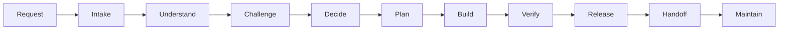
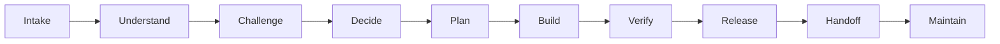
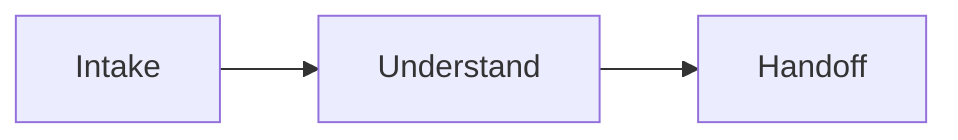
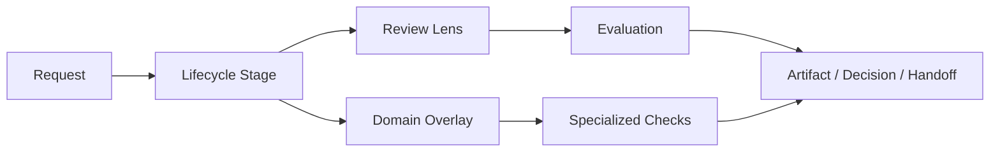
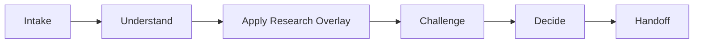
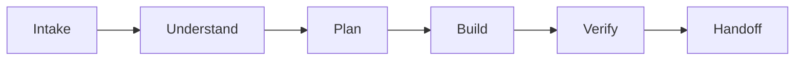
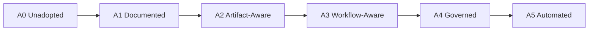
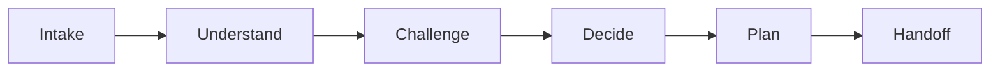
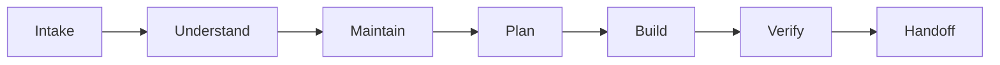
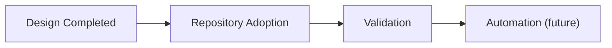

Languages: [ English](README.md) · [ Italiano](README.it.md)

# Agent OS

Most AI agent frameworks optimize execution.

Agent OS optimizes judgment.

It provides lifecycle, governance, review, knowledge management, and decision-making workflows for AI-assisted engineering.

Built to work with Codex, Claude Code, Gemini CLI, OpenHands, Cursor-like agents, and future agent platforms.

---

⚠️ Agent OS is currently in active validation.

The architecture and governance model are complete.
The next phase is real-world adoption and feedback.

Contributions, critiques, and experiments are welcome.

---

Agent OS is a working model for agent-assisted software engineering.

It starts from a practical problem: on real repositories, the hard part is not getting an AI agent to write code. The hard part is getting the agent to understand the project, choose the right level of process, preserve useful context, and avoid shortcuts where shortcuts are expensive.

This repository documents that operating model.

Agent OS is not a library, runtime, scaffolder, or folder generator. For now, it is a specification: a shared way to guide agents through research, decisions, implementation, maintenance, review, handoff, and governance inside a codebase.

It is model-agnostic by design. It can be used with Codex, Claude Code, Gemini CLI, OpenHands, Cursor-like agents, and whatever capable agents come next. The important unit is not the model vendor. It is the lifecycle of the work.

It optimizes judgment, not just execution. The system is meant to preserve decisions, context, knowledge, and verification evidence so the next agent session does not have to rediscover the same ground.

## Table of contents

* Why it exists
* Who it is for
* What problems it addresses
* How the idea evolved
* The main lessons
* The current model, with lifecycle diagram
* Key concepts, including stages, lenses, overlays, and artifacts
* What Agent OS is not
* Why automation is not the starting point
* How to use it, with adoption levels
* Example workflows
* Repository structure
* Documentation status
* Current status

## Why it exists

AI agents move quickly. Sometimes too quickly.

In a real codebase, speed without discipline turns into noise: vague plans, files changed before the problem is understood, decisions left in chat history, skipped verification, and documentation that drifts out of date without anyone noticing.

Agent OS adds a minimal structure around that work. Not to slow everything down, but to make sure each request gets the right amount of understanding, challenge, decision-making, verification, and memory.

A typo fix should not become an architecture review. A data migration cannot be treated like a local patch.

## Who it is for

Agent OS is for people working in repositories where context matters: software engineers, architects, platform engineers, DevOps engineers, maintainers, and power users of coding agents.

It is useful when agents are not only producing isolated snippets, but are participating in technical research, architectural decisions, implementation, maintenance, review, or handoff across sessions.

It also helps solo developers and small teams that rely heavily on AI agents. In that setting, the same person often carries architecture, implementation, documentation, operations, and decisions at once. Agent OS helps keep continuity between sessions.

It may be unnecessary for small repositories, mostly local and reversible work, or quick throwaway AI assistance. In those cases, Agent OS can be more structure than the work needs.

## What problems it addresses

Agent OS is meant for the point where these problems start showing up:

* unclear requests turning into code too early
* architectural decisions trapped in conversation history
* research without sources, freshness checks, or explicit recommendations
* review language mixing challenge, critique, QA, and code review
* handoffs treated as authoritative documentation
* automation introduced before the team knows what should be automated
* agents failing to distinguish local edits from risky actions
* maintenance treated as generic cleanup instead of governed work

The goal is not more process everywhere. The goal is less hidden interest paid later.

## How the idea evolved

The first version was a list of skills and pipelines: Discovery, Research, Decision, Implementation, Application Design, Maintenance, Review.

That was useful, but too flat. Some concepts overlapped. Research looked like a pipeline, then a stage, then an overlay. Review, Critique, and Challenge were too easy to blur together. Handoff appeared everywhere, but without a clear responsibility.

The design review pushed Agent OS toward one central choice: it should be lifecycle-first.

The lifecycle is the spine. Overlays add specialized requirements. Review lenses evaluate work. Governance decides what is authoritative, what is temporary, and what must be updated.

That led to several accepted decisions:

* Research is not a lifecycle stage. It is a specialized route through the Research Overlay.
* Diagnosis is not a lifecycle stage. It is an overlay.
* Release and Handoff are separate.
* The generic Maintenance Overlay is deprecated. Maintenance goes through the Maintain stage.
* Knowledge management starts with files and rules, not tools.
* A3 Workflow-Aware is the reference target, while A1 remains the lightweight entry point.

These decisions are recorded in `docs/decisions/COS_ACCEPTED_DECISIONS.md`.

## The main lessons

Agent OS began as a collection of skills and pipelines. The more the design was tested, the clearer it became that the core problem was not finding more skills.

The hard part is deciding when to use them.

How much process does a small request need? When should research become a decision? Where should context be saved? How does an architectural choice survive beyond one chat session?

That moved the design toward lifecycle and governance. Skills still matter, but they are not the center. The center is how work moves from request to decision, from decision to verification, and from verification to reusable knowledge.



## The current model

The Agent OS lifecycle is:



The same path as a flow:


Not every request uses every stage.

An informational answer may only need:



A normal feature goes through plan, build, and verify. A production rollout includes Release. An incident may use both the Incident Overlay and the Diagnosis Overlay.

The stages keep the work legible:

* `Intake`: classify the request
* `Understand`: read context, code, docs, and constraints
* `Challenge`: test whether the approach holds
* `Decide`: choose a direction
* `Plan`: break down the work and define verification
* `Build`: make the approved change or take the approved action
* `Verify`: produce fresh evidence
* `Release`: handle rollout, rollback, migrations, and production concerns
* `Handoff`: preserve state, risks, evidence, and next steps
* `Maintain`: reduce drift, stale knowledge, and unmanaged debt

## Key concepts

This is the basic relationship between a request, the lifecycle, review lenses, domain overlays, and the output that remains after the work:



### Lifecycle

The lifecycle is the default path through the work. It prevents two opposite failures: jumping straight into code, or turning every request into a heavyweight process.

The actual route depends on the request.

A technical evaluation might use:



A contained application change might use:



### Overlays

Overlays add specialized checks without changing the lifecycle.

Current overlays are:

* UX/Application
* API/Interface
* Security/Privacy
* Data/Migration
* Infrastructure/Kubernetes
* AI Application
* Research
* Diagnosis
* Incident

Research and Diagnosis are the clearest examples. They are not stages. They are specialized modes applied when the work calls for them.

### Review lenses

Review lenses are ways to evaluate an artifact or plan.

* Challenge: questions validity, scope, and assumptions
* Critique: improves an idea that has already been accepted
* Code Review: looks for problems in code
* QA: checks user-visible behavior
* Security: looks at abuse, permissions, data, and input
* Architecture: checks boundaries, coupling, and ownership
* Operations: checks deployment, rollback, and observability

When in doubt: Challenge first, Critique later.

### Governance

Governance means knowing what counts.

An accepted ADR carries more authority than a handoff. A handoff may contain useful context, but it does not create policy. Code shows what happens today, but not always what was intended.

Agent OS uses files such as:

```text
.codex/adoption.md
.codex/governance.md
.codex/routing.md
.codex/authority.md
.codex/execution.md
.codex/knowledge-map.md
```

There is no required tooling yet. Governance is manual, readable, and repository-local.

### Blast radius

Blast radius describes how much damage a wrong change can cause.

* Level 0: informational
* Level 1: local and reversible
* Level 2: one module or workflow
* Level 3: public contract, multiple modules, permissions, or schema
* Level 4: production, security, data, or irreversible action

The higher the level, the more the agent needs challenge, explicit decisions, verification, and human confirmation.

## What Agent OS is not

Agent OS is not:

* an installable package
* a runtime
* a scaffolding generator
* a set of wrappers
* a template collection
* a replacement for technical judgment
* an excuse to turn every task into bureaucracy

At this stage, Agent OS is a work specification. The process should be validated before automation is added.

## Why automation is not the starting point

The obvious move would be to start with a bootstrap script, a few templates, and maybe a command that generates the folder structure.

That would be more visible, but less reliable.

Agent OS starts with lifecycle, governance, authority, artifacts, and knowledge management because those are the parts that decide whether the system holds up. If a repository does not know what is authoritative, what is temporary, when confirmation is required, or when durable knowledge must be updated, a script will only repeat the wrong behavior faster.

Automating too early freezes immature decisions. A generator can create folders, but it cannot know whether a repository really needs A3. A wrapper can force a route, but it cannot replace judgment about blast radius, security, or public contracts.

For that reason, automation stays outside the core for now. First, validate the process in real repositories. Then decide what deserves automation.

## How to use it

For a new or existing repository, start with A1.

A1 means:

* `AGENTS.md` declares that the repository uses Agent OS
* `.codex/adoption.md` records the repository's adoption level
* risky actions require confirmation

When decisions, contracts, research, and durable documentation start to matter, move to A2.

When agents are doing real work in the repository, including implementation, debugging, release, and maintenance, move to A3. A3 is the reference target.

Adoption stays progressive:



The practical guide is in `docs/guides/COS_BOOTSTRAP_GUIDE.md`.

## Example workflows

### Technology evaluation

Question:

```text
Should we use NATS or Redis Streams for internal events?
```

Route:


Expected outputs:

* Research Brief
* Options Matrix
* Recommendation Memo
* Source Notes

If the decision is important and hard to reverse, it becomes an ADR.

### Architecture decision

Question:

```text
Should authorization logic move from controllers into a policy layer?
```

Route:



The point is not to write code immediately. First, the agent needs to understand who consumes the contract, which rules change, what might break, and where the decision should be recorded.

Typical output:

* Challenge Review
* ADR
* implementation plan

### Application design

Question:

```text
Design the user invitation flow for an admin panel.
```

Route:


Likely overlays:

* UX/Application
* Security/Privacy
* API/Interface

Worth preserving:

* user workflow
* UI states
* permission rules
* API contract, if needed

### Implementation

Task:

```text
Add pagination to the audit log endpoint.
```

Route:


If the API contract changes, apply the API/Interface Overlay. If audit logs include sensitive data, apply Security/Privacy as well.

The important part is `Verify`: no completion claim without fresh evidence.

### Maintenance

Task:

```text
Review the repository for stale documentation, risky dependencies, and architecture drift.
```

Route:



The generic Maintenance Overlay is deprecated. Maintenance is a stage. Future overlays may cover areas such as Documentation Health or Dependency Health, once their rules are clear.

## Repository structure

The reference A3 target is:

```text
/
├── AGENTS.md
├── .codex/
│   ├── adoption.md
│   ├── governance.md
│   ├── routing.md
│   ├── authority.md
│   ├── execution.md
│   └── knowledge-map.md
├── docs/
│   ├── specs/
│   │   ├── COS_FINAL_SPEC.md
│   │   ├── COS_ARCHITECTURE.md
│   │   ├── COS_GOVERNANCE_SPEC.md
│   │   ├── COS_IMPLEMENTATION_ARCHITECTURE.md
│   │   └── skunklabs-codex-os-spec.md
│   ├── decisions/
│   │   ├── COS_ACCEPTED_DECISIONS.md
│   │   └── COS_DECISIONS.md
│   ├── guides/
│   │   └── COS_BOOTSTRAP_GUIDE.md
│   ├── reviews/
│   │   ├── COS_ARCHITECTURE_REVIEW_V2.md
│   │   └── COS_DESIGN_REVIEW.md
│   ├── architecture/
│   ├── adr/
│   ├── product/
│   ├── contracts/
│   ├── operations/
│   ├── research/
│   ├── maintenance/
│   └── glossary.md
└── .codex-work/
    ├── handoffs/
    ├── investigations/
    └── verification/
```

This structure should not be created all at once. Create it when it becomes useful.

The most important distinction is:

* `.codex/` contains local Agent OS rules
* `docs/` contains durable knowledge
* `.codex-work/` contains temporary working context

`.codex-work/` is ephemeral by default. If a note there changes a decision, contract, incident, release, or long-term project knowledge, promote it into `docs/`.

## Documentation status

English is the primary language for open source documentation in this repository.

The README is available in both English and Italian. The rest of the documentation has not been translated yet; existing specs, decisions, guides, and reviews are left as they are for now.

More translations may be added later when the source documents stabilize.

## Current status

The project is here:



The core design now has a coherent shape: lifecycle, overlays, review lenses, governance, authority model, repository structure, and accepted decisions are documented.

The next step is not tooling. It is adopting Agent OS in real repositories and observing where it helps: which files agents actually read, which decisions they recover, which handoffs prevent lost work, and which parts are too heavy.

Open directions are concrete:

* define the Diagnosis Overlay more precisely
* write manual bootstrap checklists for A1, A2, and A3
* clarify minimum artifact schema requirements without full templates
* define the promotion policy from `.codex-work/` to `docs/`
* test A3 on real repositories
* evaluate A5 Automation only after that validation

Agent OS is not about producing more code. It is about preserving the context that makes code understandable: decisions, reasons, constraints, past mistakes, lessons learned, and verification evidence.

It does not replace human judgment. It gives that judgment memory.
