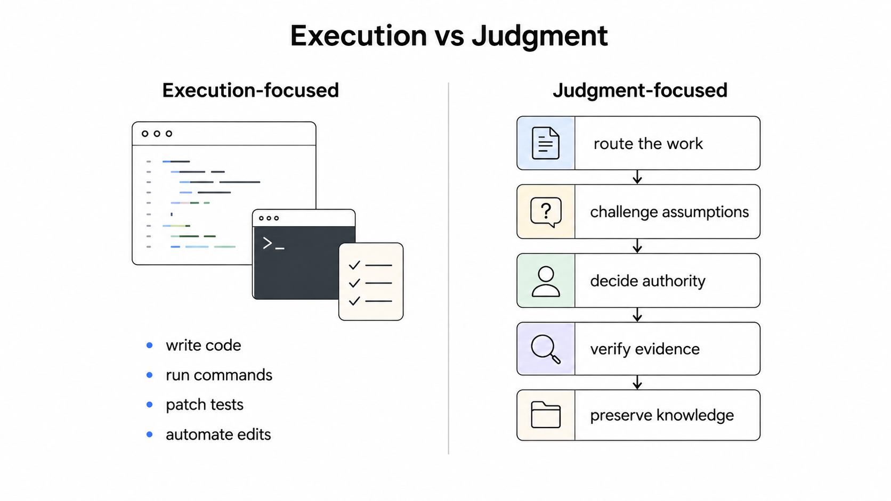
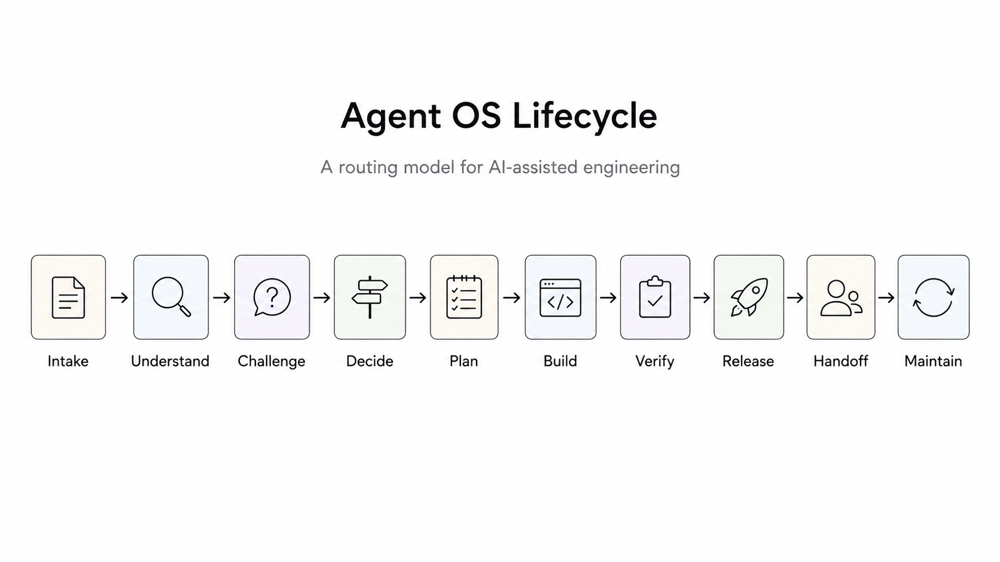
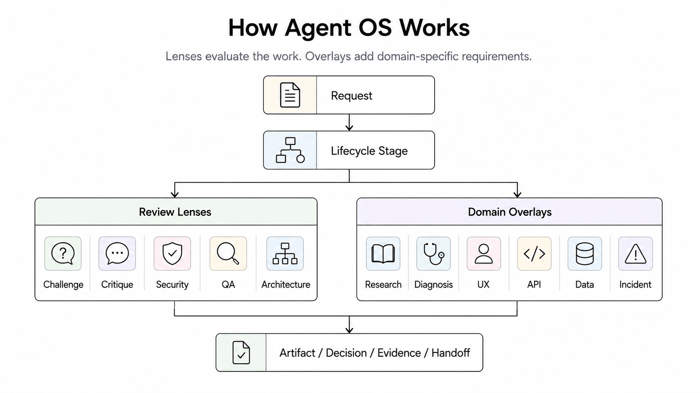
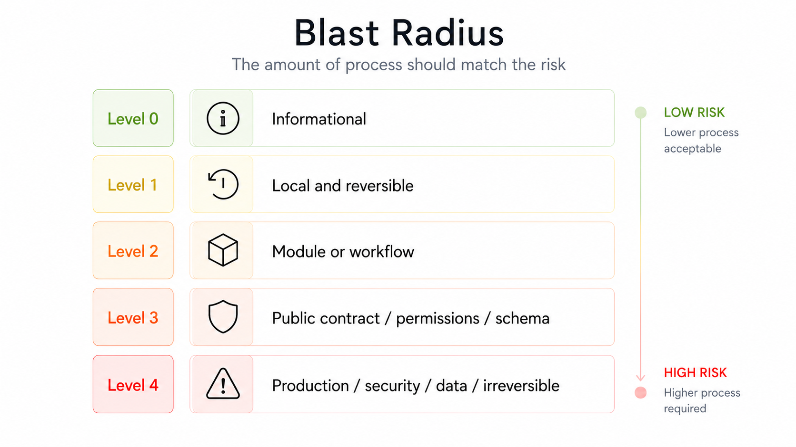

# Gli agenti AI sanno eseguire. Il problema è farli giudicare meglio.

[ English version](medium-agent-os.md)

Un modello operativo pratico per usare agenti AI su repository reali senza perdere contesto, decisioni e disciplina tecnica.

La maggior parte dei framework per agenti AI ottimizza l'esecuzione.

Agent OS ottimizza il giudizio.


*Agent OS non serve a rendere gli agenti più veloci. Serve a rendere il loro lavoro più responsabile.*

La differenza pesa più di quanto sembri.

Gli strumenti AI per l'ingegneria software sono ormai molto bravi a fare cose rapidamente. Codex, Claude Code, Gemini CLI, OpenHands, agenti in stile Cursor e strumenti simili possono ispezionare file, scrivere codice, modificare test, spiegare errori e automatizzare lavoro ripetitivo. Usati bene, cambiano davvero il modo in cui si costruisce software.

Ma appena si esce dagli snippet isolati, l'esecuzione non è più la parte difficile.

La parte difficile è far capire all'agente che tipo di lavoro sta facendo.

È una piccola modifica locale o un cambio di contratto pubblico? È un bug fix o la root cause è ancora ignota? È ricerca o è una decisione? È contesto di handoff o policy architetturale duratura? L'agente ha il permesso di eseguire il comando che vuole eseguire? Quale evidenza dimostra che il lavoro è finito?

Queste non sono domande di implementazione. Sono giudizio tecnico.

Agent OS prova a rendere esplicito quel giudizio.

Non è un runtime, un wrapper, un pacchetto, uno scaffolder o un vendor di agenti. È un modello operativo per repository usati con agenti AI: un modo per instradare le richieste, conservare contesto, registrare decisioni, applicare review lens, gestire la conoscenza e pretendere evidenza di verifica prima di dichiarare un lavoro concluso.

È anche ancora in validazione attiva. L'architettura e il modello di governance sono documentati, ma la fase successiva è uso reale e feedback.

Il momento conta. Gli agenti stanno andando oltre l'autocomplete. Ora modificano repository, eseguono tool, creano piani e portano avanti lavoro tra sessioni diverse. Più agency diamo loro, più serve un modello operativo per il giudizio, non solo un percorso più rapido verso l'esecuzione.

## Il problema da cui nasce Agent OS

Il progetto nasce da una frustrazione pratica: gli agenti si muovono in fretta, ma i repository reali hanno bisogno di continuità.

Per un task piccolo e isolato, spesso la velocità basta. Chiedi a un agente di riscrivere una frase, generare una utility o spiegare un messaggio di errore, e il costo di un'imprecisione è di solito basso.

Le codebase reali sono diverse.

Ci sono decisioni già prese, contratti, pattern, vincoli operativi, regole sui dati, aspettative di sicurezza e abitudini di team che non sempre sono scritte. Una modifica può sembrare locale e intanto toccare una forma API, un modello di permessi, un percorso di deploy o un workflow utente.

Senza struttura, le sessioni con agenti tendono a fallire in modi molto riconoscibili:

* richieste vaghe diventano codice troppo presto
* decisioni architetturali restano intrappolate nella chat
* la ricerca manca di note sulle fonti, controlli di freschezza o una raccomandazione vera
* review, critique, challenge, QA e code review si confondono
* gli handoff vengono trattati come policy
* la verifica viene saltata o riassunta senza evidenza fresca
* l'automazione arriva prima di sapere cosa andrebbe automatizzato
* la manutenzione diventa pulizia generica invece che lavoro governato

Rendere l'agente più veloce non risolve questi problemi.

Il lavoro ha bisogno di un lifecycle.

## Perché l'esecuzione non basta

L'esecuzione risponde a una domanda: "L'agente può fare qualcosa?"

L'ingegneria deve fare prima un'altra domanda: "Cosa va fatto, con quale livello di rigore, con quale evidenza e sotto quale autorità?"

Una migrazione dati non va instradata come una correzione di copy. Un incidente di produzione non va trattato come un test unitario fallito in locale. Una valutazione tecnologica non può finire con "sembra ok" se la decisione è costosa da invertire. Un handoff non deve diventare policy architetturale in silenzio.

Il problema non è che gli agenti non abbiano capacità. Il problema è che capacità senza routing produce rumore.

Agent OS tratta il lavoro dell'agente come qualcosa che attraversa fasi:

```text
Intake -> Understand -> Challenge -> Decide -> Plan -> Build -> Verify -> Release -> Handoff -> Maintain
```

Non tutti i task usano tutte le fasi. È proprio questo il punto.

Una risposta diretta può richiedere solo intake, comprensione e handoff. Una modifica contenuta richiede pianificazione, build e verifica. Una release richiede controlli operativi. Un incidente richiede contenimento, diagnosi, verifica, gestione del rilascio e follow-up.

Il lifecycle esiste per evitare due cattivi default: buttarsi nel codice prima di capire il problema, e applicare processo pesante a lavoro che non ne ha bisogno.

## Perché skill, wrapper e prompt trick non bastano

Le prime versioni di Agent OS assomigliavano di più a una lista di skill e pipeline: discovery, research, decision, implementation, application design, maintenance, review.

Aiutava, ma era troppo piatto.

Il problema non era trovare altre skill. Il problema era decidere quando usarle.

Research deve essere una fase del lifecycle o un overlay applicato quando servono conoscenze esterne o sensibili al tempo? Diagnosis è una fase o una modalità specializzata per errori non ancora spiegati? Review e critique sono la stessa cosa? Quando serve challenge prima di accettare un piano? Dove va la conoscenza dopo la verifica?

I wrapper non rispondono a queste domande. Nemmeno i prompt trick, almeno non in modo affidabile. Possono migliorare il comportamento dentro un singolo passaggio, ma non definiscono il modello operativo attorno a quel passaggio.

Agent OS si è spostato verso un'architettura lifecycle-first. Il lifecycle è la spina dorsale. Le review lens valutano il lavoro. Gli overlay aggiungono controlli specializzati. La governance decide cosa è autorevole. La gestione della conoscenza conserva contesto duraturo. Il blast radius stabilisce quanto rigore serve.

Le skill contano ancora. I tool contano ancora. I prompt contano ancora.

Ma non sono l'architettura.

## Il lifecycle

Il lifecycle centrale è:


*Il lifecycle non è una checklist. È un modello di routing.*

I nomi sono volutamente semplici.

`Intake` classifica la richiesta e il rischio probabile. `Understand` costringe l'agente a ispezionare il contesto rilevante prima di agire. `Challenge` chiede se il piano o l'idea debba procedere davvero. `Decide` registra direzione e razionale quando serve una decisione. `Plan` trasforma l'intento in lavoro ordinato, con criteri di accettazione. `Build` esegue la modifica locale o l'azione approvata. `Verify` produce evidenza fresca. `Release` gestisce rollout, rollback, migrazione, monitoring o operazioni di produzione quando rilevanti. `Handoff` conserva stato, rischi, evidenza e domande aperte. `Maintain` si occupa di drift e conoscenza stantia.

Può sembrare molto, ma la route deve restringersi per il lavoro piccolo. Una risposta diretta non ha bisogno di `Build`. Una modifica locale potrebbe non avere bisogno di `Release`. Una modifica di produzione probabilmente sì.

Il lifecycle non è una checklist da eseguire alla cieca. È un modello di routing.

Per il lavoro piccolo, Agent OS dovrebbe quasi sparire. Dovrebbe diventare visibile solo quando rischio, incertezza, permanenza o costo di coordinamento rendono necessario il giudizio.

## Review lens

Agent OS separa modalità di review che spesso vengono mischiate.

Challenge è quella scomoda. Chiede se l'idea, il piano o la decisione debbano procedere. Le assunzioni sono vere? Lo scope è troppo largo? Esiste una strada più sicura? Stiamo ignorando un modo in cui questa cosa può fallire?

Critique è diverso. Critique migliora un'idea che è già stata accettata.

Code Review cerca correttezza, manutenibilità, sicurezza, performance e test mancanti. QA controlla il comportamento visibile all'utente rispetto ai criteri di accettazione. Security guarda abuse path, permessi, segreti, dati sensibili e input non sicuri. Architecture guarda confini, accoppiamento, ownership e astrazioni. Operations guarda deploy, rollback, osservabilità e supportabilità.

La distinzione è pratica. Se l'approccio è sbagliato, lucidarlo è tempo perso. Challenge viene prima di critique.

## Overlay

Gli overlay aggiungono requisiti specializzati senza sostituire il lifecycle.

Il modello attuale include overlay per UX/Application, API/Interface, Security/Privacy, Data/Migration, Infrastructure/Kubernetes, AI Application, Research, Diagnosis e Incident.

Research non è una fase del lifecycle. Si applica quando il lavoro dipende da fonti esterne, vendor, framework, modelli AI, standard, librerie o altri fatti tecnici sensibili al tempo. Research può richiedere note sulle fonti, una matrice di opzioni e un memo di raccomandazione.

Anche Diagnosis non è una fase del lifecycle. Si applica quando ci sono errori non ancora spiegati, test falliti, bug, sintomi di produzione o comportamenti inattesi. Per gli errori non banali e non ancora spiegati, la root cause dovrebbe essere stabilita prima di build. Una correzione senza diagnosi è spesso solo un'ipotesi con una diff.

Gli incident possono combinare overlay:

```text
Intake -> Understand -> Apply Incident Overlay -> Apply Diagnosis Overlay -> Plan -> Build -> Verify -> Release -> Handoff -> Maintain
```

Incident Overlay gestisce severità, impatto, contenimento, rollback, comunicazione e follow-up. Diagnosis Overlay gestisce l'indagine causale. Release gestisce rollout e validazione in produzione.

Tenere separate queste responsabilità rende il lavoro più facile da ragionare.



*Le lens valutano il lavoro. Gli overlay aggiungono requisiti specifici del dominio.*

## Governance

Governance è la parte che decide cosa conta.

Un ADR accettato ha più autorità di una nota di handoff. Un handoff può essere utile, ma non crea policy. Il codice sorgente prova il comportamento attuale, ma non sempre il comportamento previsto. Più recente non significa automaticamente più autorevole. La ricerca stantia va rivalidata prima di guidare una decisione.

Questo conta perché le sessioni con agenti sono piene di contesto, e non tutto il contesto deve governare il lavoro futuro.

Agent OS tratta anche l'esecuzione come qualcosa che richiede permessi. Una fase del lifecycle non concede autorità. `Build` può significare modifiche locali al codice, ma può anche significare preparare o svolgere un'azione operativa. Cambi di produzione, operazioni distruttive, modifiche irreversibili ai dati, gestione di segreti, cambi ai permessi, rotture di contratti pubblici, operazioni con costo esterno ed eccezioni di sicurezza richiedono conferma esplicita.

Quel confine non è burocrazia. È il modo in cui il sistema separa "l'agente può farlo" da "l'agente è autorizzato a farlo".

## Blast radius

Il blast radius è il modo più semplice per decidere quanto processo merita un task.

Agent OS usa cinque livelli:

* Level 0: informativo
* Level 1: locale e reversibile
* Level 2: un modulo o workflow
* Level 3: contratto pubblico, più moduli, permessi o schema
* Level 4: produzione, sicurezza, dati o azione irreversibile

Più sale il blast radius, più l'agente ha bisogno di challenge, decision capture, verifica, documentazione e conferma umana.


*La quantità di processo dovrebbe seguire il rischio.*

Qui Agent OS prova a restare pratico. Non dice "usa sempre tutto il processo". Dice che la quantità di processo deve seguire il rischio.

## Una richiesta piccola che piccola non è

Immagina di chiedere a un agente di "ripulire la logica di autorizzazione".

Sembra un refactor. Potrebbe esserlo.

Ma potrebbe anche cambiare chi può fare cosa.

Se la logica di autorizzazione vive dentro i controller, spostarla in un policy layer può modificare il comportamento pubblico. Può cambiare controlli sui permessi, semantica degli errori, audit logging, risposte API o assunzioni nei test. Se il sistema ha admin, owner, guest, service account o confini tra tenant, una pulizia può diventare rapidamente un cambio di sicurezza.

Agent OS non instraderebbe quella richiesta come "refactor un po' di codice" senza prima controllare il blast radius.

L'agente dovrebbe capire il modello di permessi attuale, ispezionare contratti e test esistenti, identificare chi consuma quel comportamento e fare challenge sul fatto che la modifica sia davvero behavior-preserving. Se il refactor cambia policy, il lavoro può richiedere un ADR o un aggiornamento di contratto. Se tocca permessi, probabilmente serve Security/Privacy overlay. Se modifica comportamento API pubblico, serve API/Interface overlay. Se può esporre o bloccare azioni utente, potrebbe servire conferma umana prima di `Build`.

Anche la verifica cambia. Un test unitario verde non basta se il rischio è permission drift. L'agente deve produrre evidenza che gli utenti autorizzati restino autorizzati, quelli non autorizzati restino bloccati, il comportamento degli errori sia preservato dove richiesto, e qualunque cambio intenzionale sia documentato.

È questo il tipo di giudizio che Agent OS cerca di rendere visibile.

## Gestione della conoscenza

La gestione della conoscenza è uno dei motivi per cui Agent OS esiste.

Il lavoro degli agenti produce spesso conoscenza utile: perché una decisione è stata presa, quali alternative sono state scartate, cosa è fallito in produzione, come qualcosa è stato verificato, quali documenti sono stantii, quali assunzioni sono state invalidate.

Se quella conoscenza resta in chat, sparisce.

Agent OS parte da struttura del repository e governance invece che dal tooling. `.codex/` contiene le regole locali di Agent OS. `docs/` contiene conoscenza duratura. `.codex-work/` contiene contesto temporaneo: handoff, investigazioni e note di verifica.

La regola importante è la promozione.

`.codex-work/` è effimera per default. Se qualcosa scoperto lì cambia una decisione, un contratto, un incidente, una release o la comprensione di lungo periodo, va promosso nella documentazione duratura.

È così che una sessione con un agente smette di essere una conversazione usa-e-getta e inizia a contribuire alla memoria del repository.

## Cosa c'è già nella repository

La repository è soprattutto documentazione, per scelta. Contiene la final spec, documenti di architettura e governance, decisioni accettate, la specifica della Diagnosis Overlay e una guida di bootstrap per adottare Agent OS manualmente.

La final spec definisce lifecycle, routing, blast radius, review lens, overlay, governance, authority model, execution authority e layout della repository. Le decisioni accettate spiegano perché il modello è arrivato a questa forma. La Diagnosis Overlay dà regole operative agli errori non ancora spiegati senza trasformare la diagnosi in una fase del lifecycle.

La guida di bootstrap descrive i livelli di adozione da A0 ad A3:

```text
A0 Unadopted -> A1 Documented -> A2 Artifact-aware -> A3 Workflow-aware
```

A1 è il punto di ingresso leggero. A3 è il target di riferimento attuale. A5 automation resta intenzionalmente fuori dal core per ora.

I punti di partenza più utili sono `docs/specs/COS_FINAL_SPEC.md`, `docs/decisions/COS_ACCEPTED_DECISIONS.md`, `docs/specs/COS_DIAGNOSIS_OVERLAY.md` e `docs/guides/COS_BOOTSTRAP_GUIDE.md`.

## Cosa è ancora in validazione

Agent OS non va presentato come più maturo di quanto sia.

L'architettura e il modello di governance sono documentati. La repository è pronta per review, critique ed esperimenti. Ma il progetto è ancora in validazione attiva.

Non è un prodotto finito che finge di essere completo. È un modello operativo documentato che cerca pressione dal mondo reale.

Le domande successive sono pratiche:

* Quali file leggono davvero gli agenti durante il lavoro reale?
* Quali regole di routing aiutano, e quali risultano pesanti?
* Quali artefatti vale la pena preservare?
* Quali handoff evitano lavoro duplicato?
* Quali regole di governance sono abbastanza chiare per l'uso quotidiano?
* Dove il modello ha bisogno di linguaggio più preciso?
* Cosa dovrebbe restare manuale?
* Cosa, se qualcosa, merita automazione più avanti?

Agent OS non parte intenzionalmente da script, wrapper, generatori, validator o template. Automatizzare sarebbe prematuro se il workflow sottostante non è validato.

Il processo deve dimostrare di reggere in repository reali.

## Perché i contributi contano

Agent OS è pensato per persone che sentono già questi failure mode.

Software engineer che usano agenti ogni giorno. Architect che vedono decisioni sparire nella chat. Platform e DevOps engineer che hanno bisogno che gli agenti rispettino il rischio operativo. Maintainer che vogliono handoff che non diventino policy finta. Power user AI che hanno imparato che un prompt migliore aiuta, ma non basta.

Il progetto ha bisogno della pressione pratica di queste persone.

I contributi utili non sono solo pull request. Le critiche sono utili. Gli esperimenti falliti sono utili. I report su dove il modello sembra troppo pesante sono utili. Gli esempi in cui un agente ha saltato il giudizio sono utili. Anche piccole note di adozione da repository reali sono utili.

L'obiettivo non è costruire un grande framework. L'obiettivo è rendere l'ingegneria assistita da agenti meno smemorata, meno impulsiva e più legata all'evidenza.

## Provalo su un workflow reale

La repository è qui:

https://github.com/ignazio-ingenito/agent-os

Una star è benvenuta. La validazione reale conta di più.

Prova Agent OS su un workflow reale in una repository reale. Usalo per un task di debugging, una piccola feature, una decisione architetturale, una domanda di ricerca, una revisione di manutenzione o un piano di release.

Poi apri una issue raccontando cosa è successo:

* cosa ha funzionato
* cosa è sembrato pesante
* dove il modello si è rotto
* cosa l'agente ha ancora sbagliato
* quale artefatto o regola avresti voluto avere

Quel feedback è più utile dell'accordo. L'architettura è scritta. Il prossimo passo è capire dove regge il contatto con lavoro ingegneristico reale.
